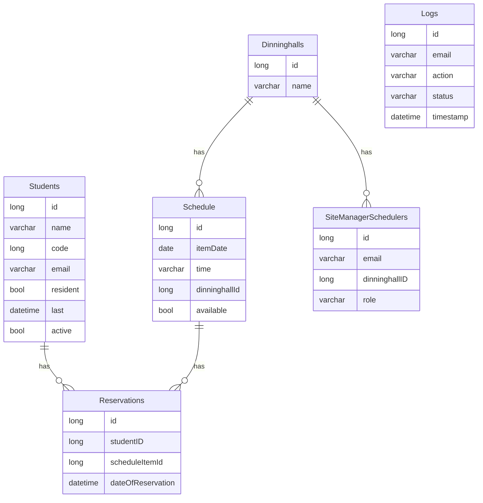

# Relationships between Database Tables

## Table `Students`
- **id**: Unique identifier of the student (Primary Key).
- **name**: Name of the student.
- **code**: Student code.
- **email**: Student's email.
- **resident**: Indicates if the student is a resident.
- **last**: Last action performed by the student.
- **active**: Indicates if the student is active.

## Table `Dinninghalls`
- **id**: Unique identifier of the dining hall (Primary Key).
- **name**: Name of the dining hall.

## Table `Schedule`
- **id**: Unique identifier of the schedule item (Primary Key).
- **itemDate**: Date of the schedule item.
- **time**: Time of the schedule item.
- **dinninghallId**: Reference to the dining hall (Foreign Key).
- **available**: Indicates if the schedule item is available.

### Relationships
- `dinninghallId` references `Dinninghalls.id`.

## Table `Reservations`
- **id**: Unique identifier of the reservation (Primary Key).
- **studentID**: Reference to the student (Foreign Key).
- **scheduleItemId**: Reference to the schedule item (Foreign Key).
- **dateOfReservation**: Date of the reservation.

### Relationships
- `studentID` references `Students.id`.
- `scheduleItemId` references `Schedule.id`.

## Table `SiteManagerSchedulers`
- **id**: Unique identifier of the site manager (Primary Key).
- **email**: Email of the site manager.
- **dinninghallID**: Reference to the dining hall (Foreign Key).
- **role**: Role of the site manager.

### Relationships
- `dinninghallID` references `Dinninghalls.id`.

## Table `Logs`
- **id**: Unique identifier of the log entry (Primary Key).
- **email**: Email of the user who performed the action.
- **action**: Action performed by the user.
- **status**: Status of the action.
- **timestamp**: Timestamp of when the action was performed.

## Relationship Diagram

